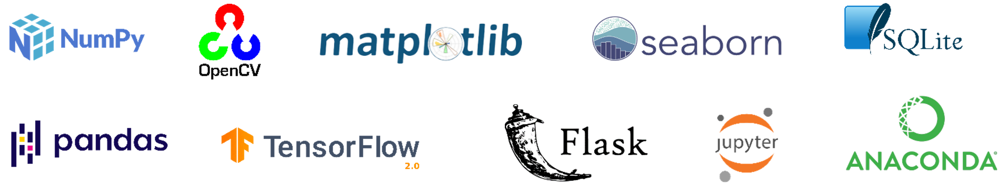

# SAT4310 - Advanced Scripting Programming

Emphasizes advanced portions of scripting programming, testing, implementation and documentation (i.e. PERL, PHP, Python and Scripting). Other topics include language syntax data and file structures, input/output devices, file, database access, and graphical user interfaces.

## Covered Topics
* Python Class and Objects
* Efficient Array Operations with Numpy and Pandas
* Python Optimization
* Database Access with SQLite
* Data Wrangling documents and spreadsheet 
* Exploratory Data Analysis and Visualization
* Web Scraping and Development 
* GUI Programming with Tkinter
* Image Processing with OpenCV
* Python Machine Learning (optional)

  

